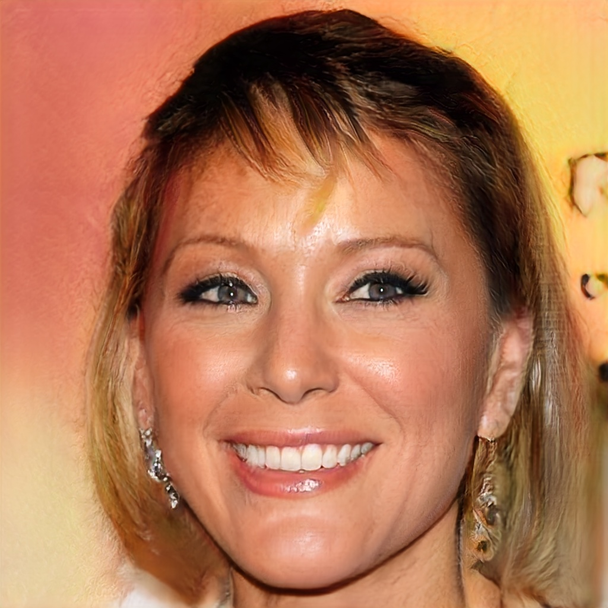

# Facial Expression Synthesis

1. [Background](#background)
2. [File Hierarchy](#file-hierarchy)
3. [Dataset](#dataset)
4. [Methods](#methods)
5. [How to Run](#how-to-run)
5. [Example Outputs](#example-outputs)
5. [Discussion](#discussion)


In recent years, facial expression synthesis has drawn significant attention in the field of computer graphics. However, challenges still arise due to the high-level semantic presence of large and non-linear face geometry variations. 

There are two main categories for facial expression synthesis; the first category mainly resorts to traditional computer graphics technique to directly warp input faces to target expressions or re-use sample patches of existing images. The other aims to build generative models to synthesize images with predefined attributes. 

Deep generative models encode expressional attributes into a latent feature space, where certain directions are aligned with semantic attributes. However, outputs of deep generative models tend to lack fine details and appear blurry or of low-resolution. In this project we explore deep generative models and techniques to finely control the synthesized
images, e.g., widen the smile or narrow the eyes. 


# File Hierarchy 
```bash
# data
data/
# Flow-based methods
flow/
# GAN-based methods 
interface_gan/
# Variational auto-encoder methods
vae/
```

<br>

# Dataset
We use the [Large Scale CelebFaces Attributes (Celeb-A)](http://mmlab.ie.cuhk.edu.hk/projects/CelebA.html) dataset to evaluate facial expression synthesis. The dataset contains over 200k images, each with 40 attribute annotations. 

The ```list_attr_celeba.txt``` file contains image ids associated with their binary attributes, where 1 indicates "has attribute" and -1 indicates "no attribute". 


**Sample images:**
  

<br>

# Methods

## <b>VAE</b> 

## <b>InterFaceGAN</b>

In using GAN based methodologies we can perform vector arithmetic in the latent space to see if the latent attributes can be disentangled. For example, can we find a particular vectorized direction such that moving along the direction changes a specific attribute (e.g. smile, pose, etc). Given a dataset, we can perform GAN inversion to get a latent space mapping for the input images. We can perform latent space manipulation on this vector space to find attributes that can be manipulated and interpolate within a certain direction. This method does assume that attributes within the latent space can be disentangled in a linear fashion.

From this idea, InterFaceGAN applies latent space manipulation to style based generators (PGGAN, StyleGAN). We consider PGGAN specifically to explore new architectures as StyleGAN as been detailed within class.

The structure of PGGAN (Progressive Growing GAN) starts with training the generator and discriminator at low spatial resolutions and progressively adding layers to increase the spatial resolution of generated images as training progresses. This method builds upon the observation that the complex mapping from latents to high-resolution images is easier to learn in steps. The process of PGGAN is shown below.

<figure>
    <p align="center">
         
    </p>
    <figcaption align="center"><b>PGGAN Training Procedure</b></figcaption>
</figure>

What InterFaceGAN does is to utilize PGGAN as a baseline synthesis method and includes conditional manipulation for latent space manipulation. Conditional manipulation is done via subspace project such that given two latent vectors z<sub>1</sub> and z<sub>2</sub>, a new latent direction can be produced by projecting one vector onto another such that the new direction is orthogonal. The idea is to make vectors orthogonal suh that moving samples along this new direction can change "attribute 1" without affecting "attribute 2".

<figure>
    <p align="center">
         
    </p>
    <figcaption align="center"><b>Conditional Manipulation via Subspace Projection</b></figcaption>
</figure>

### <u>Latent Space Disentanglement using PCA</u>

In this project, we attempt to decompose the latent space mapping from projected latent space vectors from PGGAN. We utilize machine learning methods such as Principal Component Analysis (PCA) to perform linear dimensionality reduction. The components that arise from this method will create direction vectors such that moving along these directions can produce manipulable attributes. We show that this can produce attributes that can be manipulated and interpolated, although the limitations of this method assumes that the latent space can be linearly disentangled. The results for "smile" and "pose" manipulation using PGGAN are shown below.

<figure>
    <p align="center">
        
         
        
    </p>
    <figcaption align="center"><b>Smile Manipulation</b></figcaption>
</figure>

<figure>
    <p align="center">
        
         
        
    </p>
    <figcaption align="center"><b>Pose Manipulation</b></figcaption>
</figure>

We can see from this method that latent attributes can be manipulated, however the assumption that these attributes can be linearly disentangled may be a weak assumption as other features can be altered jointly.

## <b>Flow-Based</b>

<br>


# How to Run
Follow the steps create a conda environment and [install Pytorch](https://pytorch.org/) with CUDA enabled.

```bash

```

<br>

# Example Outputs

## VAE 

## Interface GAN 

## Flow-Based

<br>


# Discussion
