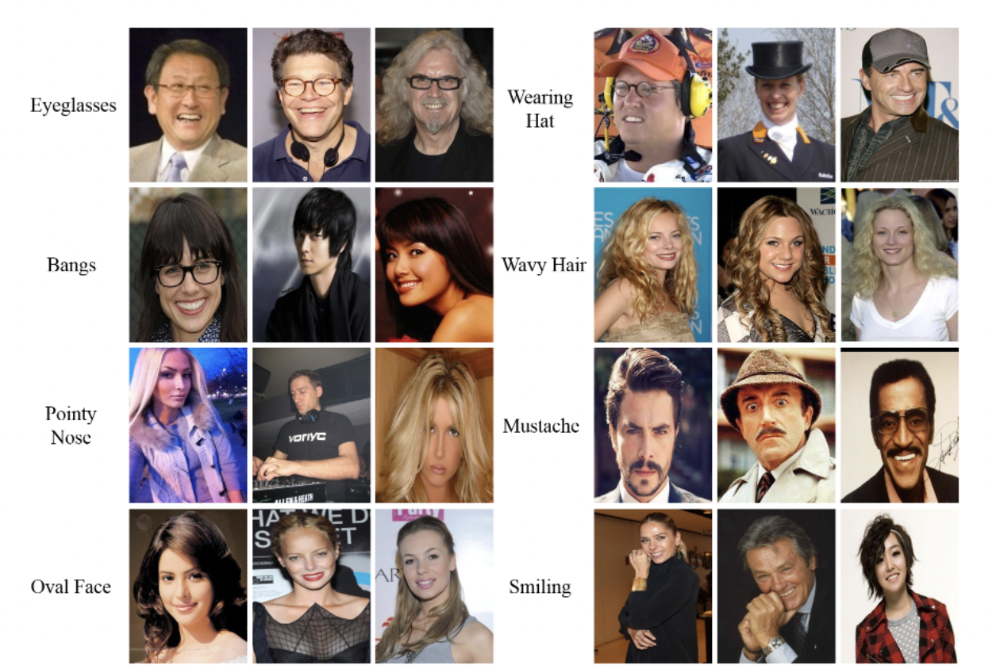
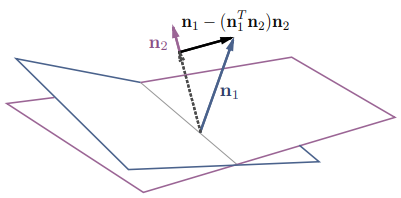
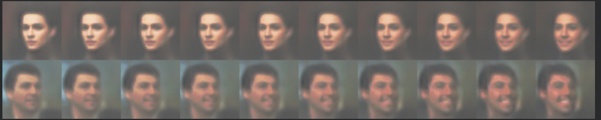
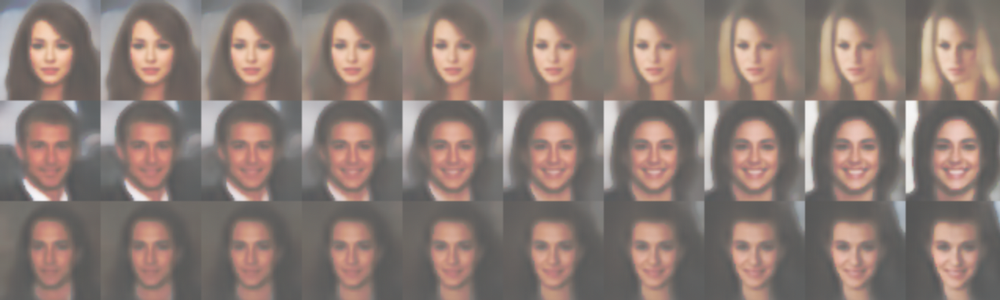
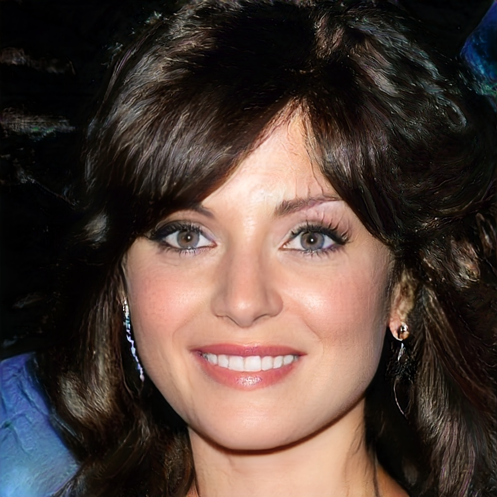
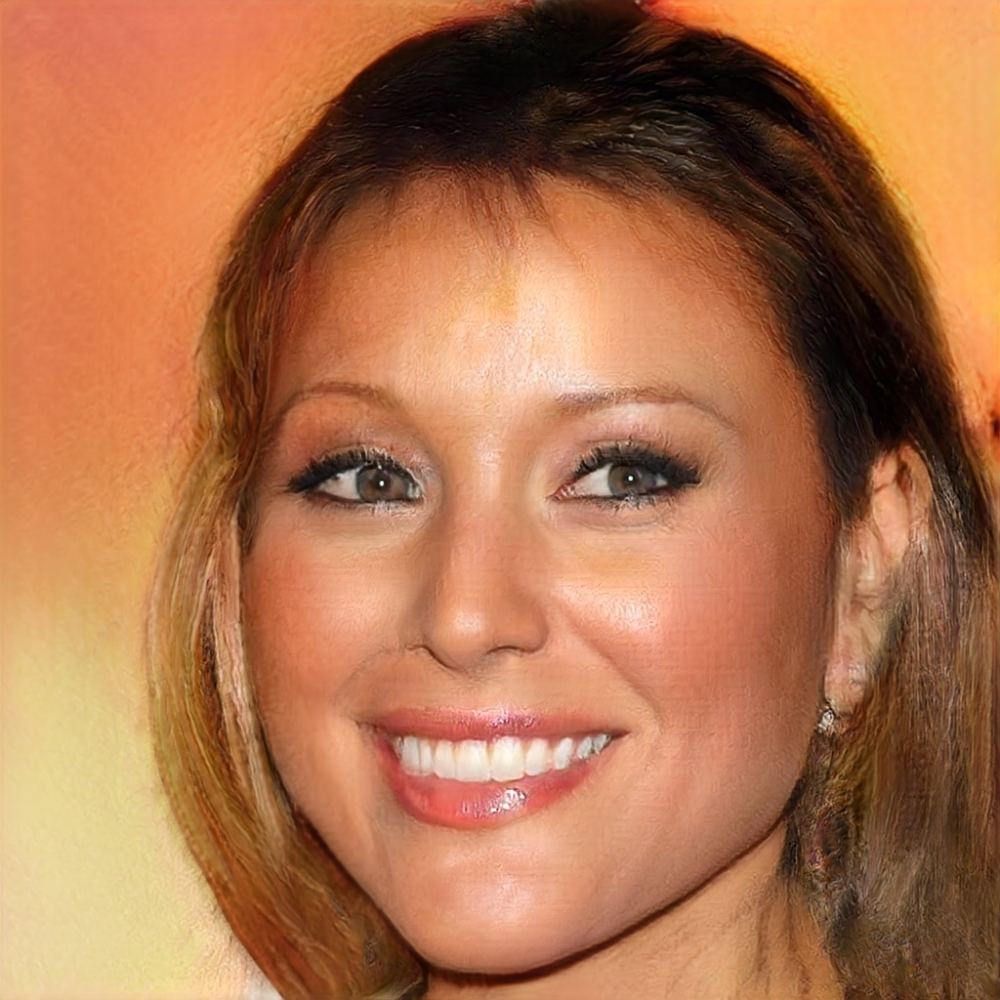
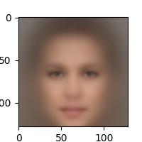
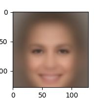
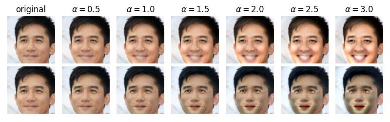

# Facial Expression Synthesis

1. [Background](#background)
2. [File Hierarchy](#file-hierarchy)
3. [Dataset](#dataset)
4. [Methods](#methods)
5. [Experiments](#experiments)
5. [Example Outputs](#example-outputs)
5. [Discussion](#discussion)

<br>

# Background
In recent years, facial expression synthesis has drawn significant attention in the field of computer graphics. However, challenges still arise due to the high-level semantic presence of large and non-linear face geometry variations. 

There are two main categories for facial expression synthesis; the first category mainly resorts to traditional computer graphics technique to directly warp input faces to target expressions or re-use sample patches of existing images. The other aims to build generative models to synthesize images with predefined attributes. 

Deep generative models encode expressional attributes into a latent feature space, where certain directions are aligned with semantic attributes. However, outputs of deep generative models tend to lack fine details and appear blurry or of low-resolution. In this project we explore deep generative models and techniques to finely control the synthesized
images, e.g., widen the smile or narrow the eyes. 


<br>

# File Hierarchy 
```bash
# data
data/
# Flow-based methods
flow/
# GAN-based methods 
interface_gan/
    pca_pose/
    pca_smile/
    interfaceGAN_latent_exploration.ipynb
# Variational auto-encoder methods
vae/
    beta_vae/
        vanilla_vae/ # initial vanilla vae experiments
        helpers.py
        preprocess.py
        evaluate.py
        models.py
        utils.py 

```

<br>

# Dataset
We use the [Large Scale CelebFaces Attributes (Celeb-A)](http://mmlab.ie.cuhk.edu.hk/projects/CelebA.html) dataset to evaluate facial expression synthesis. The dataset contains over 200k images, each with 40 attribute annotations. 

The ```list_attr_celeba.txt``` file contains image ids associated with their binary attributes, where 1 indicates "has attribute" and -1 indicates "no attribute". Example attributes include "male", "no beard", "smiling", and "straight hair".


<br>

## Preprocessing 

To preprocess our data, we define custom dataloaders in Pytorch for loading the images and their associated labels (40-dimensional binary vectors). Depending on the model, we crop and downscale images accordingly.


**Sample images:**
<p align="center">
  
</p>


<br>

# Methods

## Variational Autoencoder (VAE) 

We consider two types of state-of-the art VAEs, Beta-VAE and DFC-VAE for learning disentangled representations of features. 

### **Background: AEs & VAEs**
Autoencoders are a class of neural networks consisting of an encoder
and a decoder. Through iterative weight optimization, autoencoders
learn to encode the data into a low-dimensional space and then reconstruct (decode) the original data. 

The downside is that autoencoders have no way of synthesizing new data. Thus, 
variational autoencoders (VAEs) are introduced, in which the decoder effectively acts as a GAN (decode points that are randomly sampled from the latent space, aka ```z ~ p(z)```. ) VAEs are trained to minimize the sum of the reconstruction loss (binary cross entropy loss) and KL divergence between prior ```p(z)``` over latent variables and probabilistic encoder ```q(z|x)```: ```KL(q(z|x) || p(z|x)).```, keeping the distance between the real and estimated posterior distributions small. 

<p align="center">

  

  
</p>

 <br>

### **Beta-VAE**
[Beta-VAE (2017)](https://openreview.net/forum?id=Sy2fzU9gl)  is a type of latent variational autoencoder used to discover disentangled latent factors in an unsupervised manner. The addition of a hyperparameter ```Beta``` weights the KL divergence term, constraining the representational capacity of latent ```z``` and encouraging disentanglement. The loss function is as follows:

<p align="center">
  
</p>

 <br>

### **DFC-VAE**

[Deep Feature Consistent VAE (DFC-VAE, 2016)](https://houxianxu.github.io/assets/project/dfcvae) replaces VAE's ```L_rec``` with a deep feature perceptual loss ```L_p``` during training, ensuring that the VAE's output preserves the spatial correlation characteristics of the input. Weights ```w_i``` regularize each layer's perceptual loss term. 
<p align="center">
  
</p>
<br>

### **Latent Arithmetic on DFC-VAE**


Given specified attribute A and B corresponding to specified genders genderA and genderB, we fetch N images for each of "with_A", "without_A", "with_B", "without_B", resizing each image to 64x64x3. 

For our latent arithmetic step, we encode an image in the ```without_A``` and ```without_B``` categories to get the mu/logvar, then sample from the learned distribution to get ```z_without_A``` and ```z_without_B```. 
Then, we compute ```z_avg_A``` by differencing the average latent vectors across ```with_A``` category by the averages across ```without_A``` category to get the latent representation of attribute ```A```.

Finally, we add a weighted ```z_avg_A``` to ```without_A``` and ```without_B``` to visualize the added attribute.


```
 z_arith_A = z_avg_A + (f * z_without_A)
```


### **Latent Space Interpolation**

We also visualize interpolations between 
<ol>
    <li> identities of the same gender</li>
    <li> same gender with and without attribute</li>
    <li> identities of different gender with/without attribute </li>
</ol>
<br>

This is done using a linear combination of the given image inputs:

```
z_interp = (f * z1 + (1 - f) * z2)
```

<br>

## <b>InterFaceGAN</b>

In using GAN based methodologies we can perform vector arithmetic in the latent space to see if the latent attributes can be disentangled. For example, can we find a particular vectorized direction such that moving along the direction changes a specific attribute (e.g. smile, pose, etc). Given a dataset, we can perform GAN inversion to get a latent space mapping for the input images. We can perform latent space manipulation on this vector space to find attributes that can be manipulated and interpolate within a certain direction. This method does assume that attributes within the latent space can be disentangled in a linear fashion.

From this idea, InterFaceGAN applies latent space manipulation to style based generators (PGGAN, StyleGAN). We consider PGGAN specifically to explore new architectures as StyleGAN as been detailed within class.

The structure of PGGAN (Progressive Growing GAN) starts with training the generator and discriminator at low spatial resolutions and progressively adding layers to increase the spatial resolution of generated images as training progresses. This method builds upon the observation that the complex mapping from latents to high-resolution images is easier to learn in steps. The process of PGGAN is shown below.

<figure>
    <p align="center">
         
    </p>
</figure>

<p align="center">
    <b>PGGAN Training Procedure</b>
</p>

What InterFaceGAN does is to utilize PGGAN as a baseline synthesis method and includes conditional manipulation for latent space manipulation. Conditional manipulation is done via subspace project such that given two latent vectors z<sub>1</sub> and z<sub>2</sub>, a new latent direction can be produced by projecting one vector onto another such that the new direction is orthogonal. The idea is to make vectors orthogonal suh that moving samples along this new direction can change "attribute 1" without affecting "attribute 2".

<figure>
    <p align="center">
         
    </p>
</figure>

<p align="center">
    <b>Conditional Manipulation via Subspace Projection</b>
</p>

### <u>Latent Space Disentanglement using PCA</u>

In this project, we attempt to decompose the latent space mapping from projected latent space vectors from PGGAN. We utilize machine learning methods such as Principal Component Analysis (PCA) to perform linear dimensionality reduction. The components that arise from this method will create direction vectors such that moving along these directions can produce manipulable attributes. We show that this can produce attributes that can be manipulated and interpolated, although the limitations of this method assumes that the latent space can be linearly disentangled. The results for "smile" and "pose" manipulation using PGGAN are shown in the output section below.

## <b>Flow-Based</b>

Flow based models have attracted a lot of attention due to its ability to predict exact loglikelihood and tracts the exact latent variable inference.

In GANs, datapoints can usually not be directly represented in a latent space, as they have no encoder and might not have full support over the data distribution. This is not the case for reversible generative models and VAEs, which allow for various applications such as interpolations between datapoints and meaningful modifications of existing datapoints. We would be using one such interpolation for latent attributes manipulations, leading to meaningful manipulations to the existing features.
<br>


# Experiments
Follow the steps create a conda environment and [install Pytorch](https://pytorch.org/) with CUDA enabled. Also install OpenCV.

```bash
# Running Beta-VAE. Outputs are saved under beta-vae/<model-name>_outputs
cd beta-vae/
python evaluate.py

# Running Flow

```

## Running InterFaceGAN

[](https://colab.research.google.com/drive/1rRI_tIKjj--nLgtIhbgRBuozGdF0OU8T?usp=sharing)

The linked notebook contains the necessary code and sections for running InterFaceGAN along with PCA (and additional attempted ML methods). To load in pretrained weights for PGGAN trained on celebHQ, download the model [karras2018iclr-celebahq-1024x1024.pkl](https://drive.google.com/file/d/11NW3aruVDmxGs5z4W4H9PNvuQC8OCvbY/view?usp=sharing) and place it under the directory `models/pretrain` in the InterFaceGAN repository. The model will generate interpolations for the user.

<br>

# Example Outputs

## <b>VAE</b> 

**Latent Arithmetic: Balding**

 

**Latent Arithmetic: Eyeglasses**

 

**Latent Arithmetic: Smiling**



**Latent Interpolation: Smiling**




## <b>Interface GAN</b>

<figure>
    <p align="center">
        
         
        
    </p>
</figure>

<p align="center">
    <b>Smile Manipulation</b>
</p>

<figure>
    <p align="center">
        
         
        
    </p>
</figure>

<p align="center">
    <b>Pose Manipulation</b>
</p>

## <b>Flow-Based</b>

One of the changes we tried to the existing model is the way we decompose the 40 latent attributes (bangs, age, gender etc.), the paper proposed to consider the presence of the latent attribute as a positive vector and its absence to be negative and then summing it up. I have hereby tried to take the average of some sample of pictures for the calculation of the latent attribute vectors.

# Example Outputs

## <b>GLOW</b> 

**GLOW Based Latent Interpolation: Gender**

 

**GLOW Based Latent Interpolation: Bangs**

 

**GLOW Based Latent Interpolation: Smiling**


<br>

# Discussion

We initially experimented with latent arithmetic on Vanilla VAE, which yielded the following "no smile" and "smile" faces. 

<figure>
    <p align="center">
        
         
    </p>
</figure>

However, latent arithmetic showed poor results, which indicates that Vanilla VAE may be insufficient for encoding attributes in the latent space. 
    
<p align="center">
    
</p>
With Beta-VAE and DFC-VAE, the results are better in terms of adding/subtracting attributes from faces using latent vector arithmetic. Further improvements include training on higher-resolution images.

From InterFaceGAN we see that latent attributes can be manipulated, however the assumption that these attributes can be linearly disentangled may be a weak assumption as other features can be altered jointly. Observing the example of smile manipulation, we can add/subtract a smile but other factors such as lighting are also altered.

For GLOW based interpolation, we observe somewhat better results on averaging the attribute vectors from seveal images for some specific latent attributes. Despite of training it over 40 different attributes, we observe a disparity in learning all of them explicitly. Also, we observed that some closely related attributes, for example: balding is mainly observed in male images so the latent space learnt for balding matches maximally with gender change thus incapable of separating the 2 latent spaces. 
