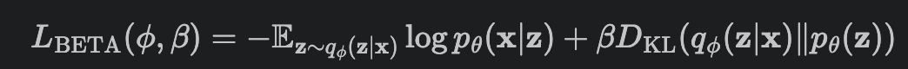

# Facial Expression Synthesis

1. [Background](#background)
2. [File Hierarchy](#file-hierarchy)
3. [Dataset](#dataset)
4. [Methods](#methods)
5. [How to Run](#how-to-run)
5. [Example Outputs](#example-outputs)
5. [Discussion](#discussion)


In recent years, facial expression synthesis has drawn significant attention in the field of computer graphics. However, challenges still arise due to the high-level semantic presence of large and non-linear face geometry variations. 

There are two main categories for facial expression synthesis; the first category mainly resorts to traditional computer graphics technique to directly warp input faces to target expressions or re-use sample patches of existing images. The other aims to build generative models to synthesize images with predefined attributes. 

Deep generative models encode expressional attributes into a latent feature space, where certain directions are aligned with semantic attributes. However, outputs of deep generative models tend to lack fine details and appear blurry or of low-resolution. In this project we explore deep generative models and techniques to finely control the synthesized
images, e.g., widen the smile or narrow the eyes. 


# File Hierarchy 
```bash
# data
data/
# Flow-based methods
flow/
# GAN-based methods 
interface_gan/
# Variational auto-encoder methods
vae/
```

<br>

# Dataset
We use the [Large Scale CelebFaces Attributes (Celeb-A)](http://mmlab.ie.cuhk.edu.hk/projects/CelebA.html) dataset to evaluate facial expression synthesis. The dataset contains over 200k images, each with 40 attribute annotations. 

The ```list_attr_celeba.txt``` file contains image ids associated with their binary attributes, where 1 indicates "has attribute" and -1 indicates "no attribute". 


**Sample images:**
  

<br>

# Methods

## VAE 


### **Background: Vanilla Autoencoders**
Autoencoders are a class of neural networks consisting of an encoder
and a decoder. Through iterative weight optimization, autoencoders
learn to encode the data into a low-dimensional space and then reconstruct (decode) the original data. 


  
 
 <br>

### **Variational Autoencoders**
The downside is that autoencoders have no way of synthesizing new data. Thus, 
variational autoencoders (VAEs) are introduced, in which the decoder effectively acts as a GAN (decode points that are randomly sampled from the latent space, aka ```z ~ p(z)```. ) VAEs are trained to minimize the sum of the reconstruction loss and KL divergence ```KL(q(z|x) || p(z|x)).```, keeping the distance between the real and estimated posterior distributions small. 

  

 <br>

### **Beta-VAE**
[Beta-VAE (2017)](https://openreview.net/forum?id=Sy2fzU9gl)  is a type of latent variational autoencoder used to discover disentangled latent factors in an unsupervised manner. The addition of a hyperparameter ```Beta``` weights the KL divergence term, constraining the representational capacity of latent ```z``` and encouraging disentanglement. The loss function is as follows:


  

 We explore Beta-VAE's performance on disentanglement in Celeb-A dataset.

## Interface GAN 

## Flow-Based

<br>


# How to Run
Follow the steps create a conda environment and [install Pytorch](https://pytorch.org/) with CUDA enabled.

```bash

```

<br>

# Example Outputs

## VAE 

## Interface GAN 

## Flow-Based

<br>


# Discussion


